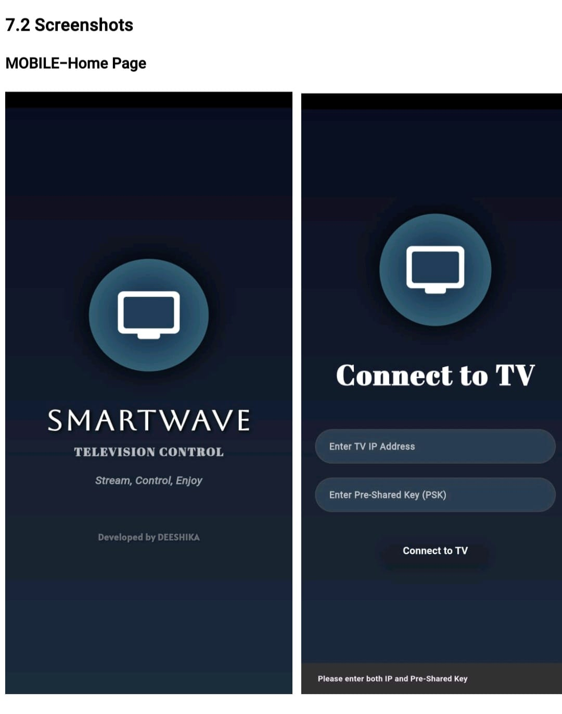
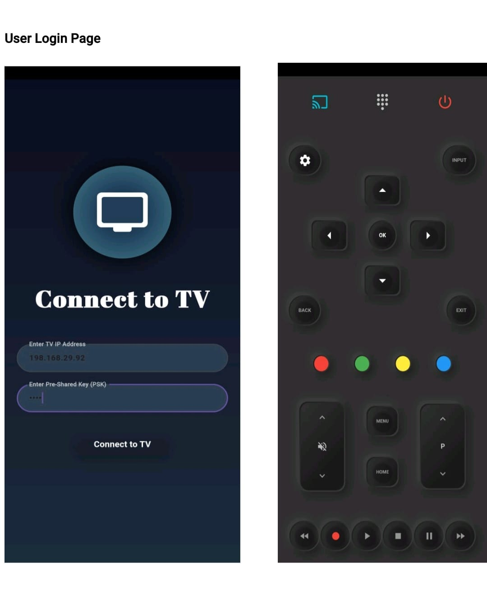
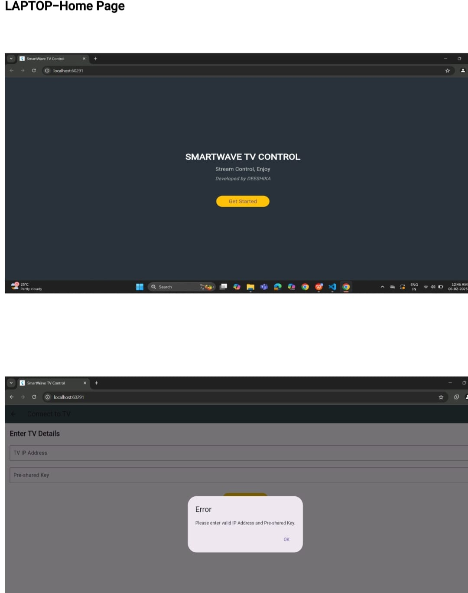
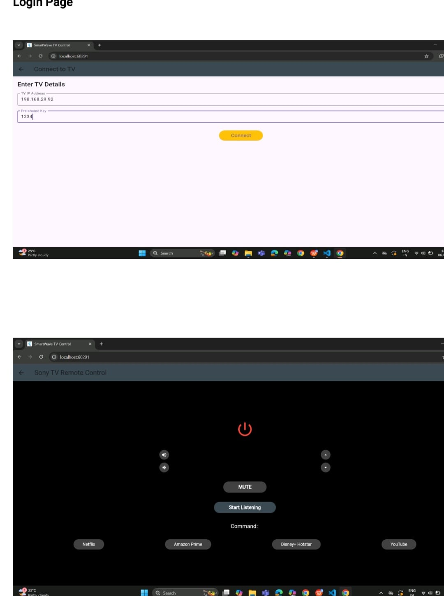
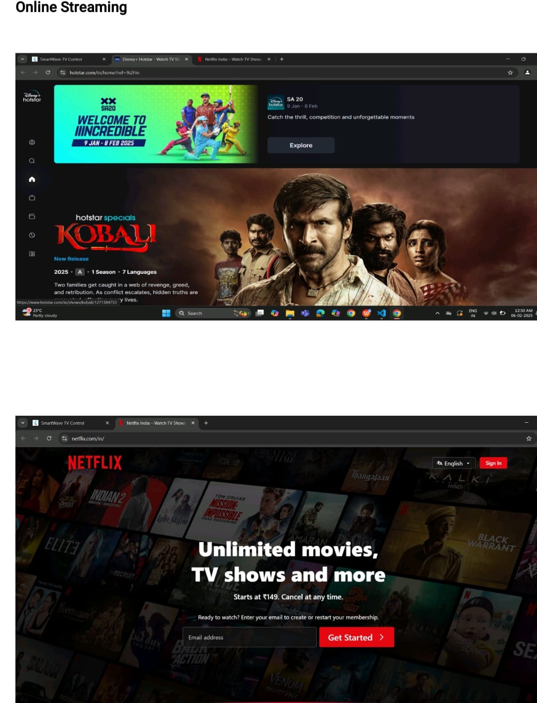
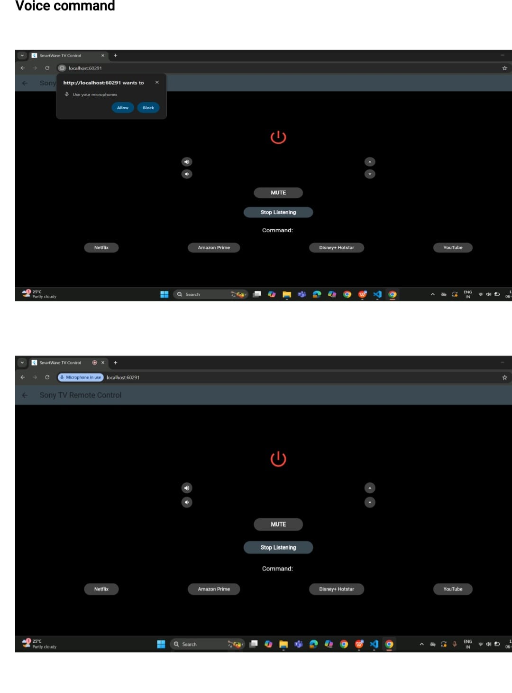

# 📱 TV Remote Control App

Android-based TV Remote Control Application developed using Flutter, enabling users to control basic TV functions through a mobile interface.

---

## 🔍 Overview

This application is designed to simulate a TV remote using a smartphone. It provides essential remote functionalities with a simple and responsive user interface.

This project highlights practical understanding of mobile UI design and remote control system simulation.

---

## 🚀 Features

* Power ON / OFF control
* Volume adjustment
* Channel switching
* Supports controlling multiple TV channels
* Simple and user-friendly interface

---

## 🛠️ Technology Used

* Flutter
* Android SDK

---

## ⚙️ Working Principle

The application works by simulating remote control actions through UI buttons. Each button is mapped to a specific function such as power, volume, or channel control using Flutter widgets and event handling.

---

## 📦 APK

The APK file is available in this repository for direct installation and testing.

---

## ▶️ How to Use

1. Download the APK file
2. Install it on your Android device
3. Open the app and use it as a TV remote

---

## 📸 Screenshots

---

## 🔮 Future Enhancements

* Integration with IR sensor for real device control
* WiFi-based Smart TV connectivity
* Voice command support

---

## 👨‍💻 Developer

Deeshika Boominathan
